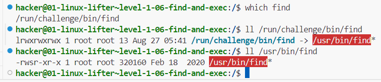
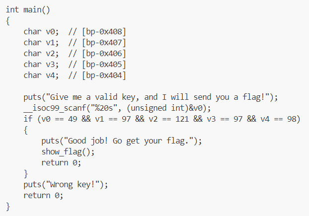

# CSE 545 - Fall '24 pwn.college Dojo

## Project 01 Linux Lifter

### .05 - find

- `find / randomly_placed_file` - way too many files
- read the man page. `find -name randomly_placed_file` found it
- didn't specify a folder to search in tho, ig it's cuz cwd is /

### .06 - find and exec

- "Optional Exercise: Why do they think it worked with `-exec` parameter of the `find` command, but we get permission denied using standalone `cat` command? Hint: SUID bit was set for the `find` command."
- indeed, we see that `/usr/bin/find` has its _setuid_ bit set:
  
- [see here](https://unix.stackexchange.com/a/389706/595039) for find stuff
- `find / -name random_cant_flag -exec cat {} ';'` worked

### .07 - return code

- `$?` is the return code of the last executed command
- range 0 to 255

### .08 - python

- SUID on python this time

### .11 - search me

- `/challenge/tester.sh` is printing `/flag` but the file is missing
- `/challenge/cp` has SUID bit set
- preliminary find revealed a possible file deep in `/tmp`
- `find /tmp/that/full/path -name flag -exec /challenge/cp {} /flag ';'`

### .12 - hash it out

- used online tool to generate SHA256

### .13 - hash full

- here we go
- a-z, 6 spaces, so 26^6 possibilities
- plaintext is 6 letters, so 48 bits. hash is SHA256 so 256 bits.
- storage per line:`<hash><plaintext>` that's 304 bits, 312 if including newline character
- total storage exceeds 11GB!!
- refinement 1: 256-bit hash is pretty unique. if we cut down on the portion of the hash stored, we should be able to save a ton of space while only slightly increasing the margin of error. let's assume plaintext has to be stored entirely for now, so total per line is 184 bits.
- eh fk it, just generated all permutations. 22GB storage, 20 min to generate, search using VSCode search took a few more minutes

## Project 02 Unwinding Binaries (Reversing)

### .01 - looking inside

- not sure how to use ghidra, didn't seem to work either
- `angr decompile /challenge/run` revealed a `strcmp` with the key, ez

### .02 - the mangler

- 'mangling' is just subtracting 3 from the char's ascii value. so just add 3 to the key

### .03 - XOR plus

- mangling is adding 3 then XOR with 2. so just XOR with 2, then subtract 3

### lab 2a.02



- ascii values

### .04 - solve for x

- NOTE: angr screwed up, and gave an incorrect result (== instead of !=)
- use ghidra (GUI) or [dogbolt](https://dogbolt.org) for binaries under 2MB
- anyway, math solving:
  - we get a few eqns:
    - v1 = v0 - 24223
    - v3 = 5v2 - 129519
  - use these eqns to reduce from brute-force 4 nested loops to 2 nested loops
  - then verifying the rest gets us one soln
- runtime < 3 seconds

### .05 - extra verification

- angr just straight up hangs lol
- holy sh\*t so many if statements
- boils down to byte by byte, check 1 or 0, check +ve or -ve (MSB)
  - 00 - 00110111
  - 01 - 01000111
  - 02 - 01000011
  - 03 - 01010110
  - 04 - 00110100
  - 05 - 01010010
  - 06 - 01011010
  - 07 - 01001001
  - 08 - 01000001
  - 09 - 00110100
  - 10 - 01011001
  - 11 - 00111000
  - 12 - 01111001
  - 13 - 00110011
  - 14 - 01110011
  - 15 - 01001000
  - 16 - 00110101
  - 17 - 00111000
  - 18 - 01101010
  - 19 - 01010111 (binary ninja and hex-rays disagreed on this, binary ninja was right)
- could have automated this smh

### .06 - extra verification II

- first ordered all if statements to get bitwise order of the string (hell.)
- for result to be 0 at the end, just don't modify it at all
- so for each if statement, check which of 0/1 makes it false (find and replace ftw)
- ascii string is 67kW6YnKvTpaqoBX1F8l
- really should have automated this

### .07 - binary labyrinth

- omg it's literally labyrinth navigation, using wasd keys LMFAO

```c
int M[12][12]={
  { 1, 0, 1, 1, 1, 1, 1, 1, 1, 1, 1, 1},
  { 1, 0, 1, 0, 0, 1, 0, 1, 0, 0, 0, 0},
  { 1, 0, 0, 0, 1, 1, 0, 1, 0, 1, 0, 1},
  { 1, 0, 1, 0, 1, 1, 0, 1, 0, 0, 0, 1},
  { 1, 0, 0, 0, 1, 0, 0, 1, 0, 0, 1, 1},
  { 1, 1, 0, 1, 1, 0, 0, 0, 0, 0, 1, 1},
  { 1, 1, 0, 1, 1, 0, 1, 1, 1, 0, 0, 1},
  { 1, 1, 0, 0, 0, 1, 1, 0, 0, 0, 1, 1},
  { 1, 1, 0, 1, 0, 1, 0, 0, 1, 1, 1, 1},
  { 1, 1, 0, 1, 0, 1, 1, 0, 1, 1, 1, 1},
  { 1, 1, 0, 1, 0, 0, 0, 0, 1, 1, 1, 1},
  { 1, 1, 1, 1, 1, 1, 1, 1, 1, 1, 1, 1}
};
```

- 1s are landmines
- start from row 1, column 2 (x=1, y=0)
- goal is row 2, column 12 (x=0xb, y=1)
- ssssdsssddsssdddwwwddwwwwdwwd
- lol

## Project 03 Hacking Network Highways

### .01 - netcat

```bash
nc 10.0.0.3 31337
```

### .02 - netcat listener

```bash
nc -l 31337
```

### .03 - nmap and netcat

```bash
nmap 10.0.0.0-255 # found in .142
nc 10.0.0.142 31337
```

### .04 - nmap in parallel and netcat

- `-sn` for ARP ping scan - no ports just discover host
- `--min-parallelism 10` for at least 10 probes at a time
- consider using `-T4` or `-T5` timing templates
- checked
  - `10.0.0.0/19` - only us at .2
  - `10.0.32.0/19` - nothing
  - `10.0.64.0/19` - 10.0.90.244 and port is 31337 as expected. stopped here

### .05 - tcpdump

- `tcpdump -A 'tcp port 31337'`
  - `-A` to print content as ASCII

### .06 - tcpdump and flow

- inspecting the /challenge/run python script, we see that it's sending one character at a time, after encoding them
- `tcpdump -s 65535 -nntA 'tcp port 31337' -w /home/hacker/my_pcaps/3.06.pcap`
  - `-s` to grab full packet (?)
  - `-nn` to avoid resolution of hostnames or port numbers
  - `-t` to exclude timestamp
  - `-A` to print content as parsable ASCII. important!!!
- then we use scapy to read the packets, skip alternating duplicates, decode, and form a single string
- ehh i messed up something but whatever

### .07 - mimic and listen

- `ip addr add 10.0.0.2 dev eth0` assign the address to us, fake
- `nc -l 10.0.0.2 31337`

### .08 - ether scapy

- jfc
- ALWAYS be explicit and define the src addresses
- didn't define the src MAC addr, so packets kept going thru `lo` instead of `eth0`
- too stupid to realize it in time too
- anyway, get current MAC addr of `eth0`
- craft Ether packet to given dest addr with type `0xFFFF`
- `srp(pkt, iface='eth0')`

### lab 3a was chill, no notes

### .09 - IP scapy

- similar
- set IP addr with `ifconfig eth0 10.0.0.2`
- add l3 with src and dest IP addr, `proto=0xFF`
- since we need MAC as well, use `srp`, not `sr`

### .10 - TCP scapy

- similar
- again, set IP addr
- add l4 with src and dest TCP port, `flags=0x1F` to set ACK (0x10), PSH (0x08), RST (0x04), SYN (0x02), FIN (0x01) flags
- `srp` again

### .11 - TCP handshake

- send SYN with specified seq and ack numbers - 31337 both
- get SYNACK
  - has ack of 31338, which will be our next syn
  - has random syn, add 1 to get next ack
- send ACK with next syn and ack numbers

### .12 - ARP scapy

- meh, arp opcode is 2

### .13 - ARP spoofing

- meh, just crafting ARP and tcpdump

### lab 3b was chill, no notes

### .14 - MiTM ARPing

- shit's getting too easy, let's not look at /challenge/run
- first, get target's macs, then arp spoof
- we don't have NET_ADMIN, so can't set ip_forward in sysctl to control MITM directly,
- first, capture packets, check raw loads
- we observe that a sequence repeats:
  - 10.0.0.3:31337 sends a command: "SECRET", to 10.0.0.4 at a random port
    - note: how does 3 know which port to send to?
      - [after 3d] idiot, 4 opens the tcp handshake
  - 4 responds with a secret, it's in ascii?
  - 3 sends a list of available (?) commands - echo, flag, and then asks for a command
  - 4 responds with echo, and sends "Hello, World!"
  - 3 echoes it back
- connection closes, repeats with another randomized port for 4
- note that 3 sends a secret and a list of commands that includes a flag command
- craft a packet masquerading as 4, with the flag command, wait for a secret to arrive and put it in the packet
  - [after 3d] idiot, read the code, you don't need the secret, just hijack the connection
- in the time it takes 3 to do the legitimate echo from 4, we could probably send the flag command to 3 and have it processed in the same ephemeral connection
- let's try

### lab 3c was chill, no notes

### lab 3d

#### .2 - mitm arping

- same as 3.14, approaching this first for deadline
- client at 3.13.37.4, random port
- server at 3.13.37.3, port 1992
- flow:
  - TCP handshake:
    - client -> SYN -> server
    - server -> SYNACK -> client
    - client -> ACK -> server
  - secret is sent:
    - server -> PUSHACK -> asks for secret -> client
    - client -> ACK, then PUSHACK -> secret string \n-> client
    - server -> ACK, then PUSHACK -> secret confirmed -> client
      - at this point, inject BACKDOOR packet before the actual client
    - client -> ACK, then PUSHACK -> ECHO: -> server
  - after backdoor, send a FLAG packet

### going back to continue 3.14 with this understanding

---

- [after 3d] updated understanding
  - client at 10.0.0.4, random port
  - server at 10.0.0.3, port 31337
  - flow:
    - TCP handshake:
      - client -> SYN -> server
      - server -> SYNACK -> client
      - client -> ACK -> server
    - secret is sent:
      - server -> PUSHACK -> asks for secret -> client
      - client -> ACK, then PUSHACK -> secret string \n-> client
      - server -> ACK, then PUSHACK -> list of commands -> client
        - at this point, inject FLAG command before the actual client
      - client -> ACK, then PUSHACK -> ECHO -> server

## Project 04 Hijacking Binary Power (Pwning)

- seems we have access to the source code, and we're given a suid-set executable

### .02 - exec them all

- title helped
- `exec -a <passwd> /challenge/run`

### .03 - altering arg[0]

- +3 lops off first 3 chars

### .04 - symmer

- symlink /flag to ~/flag

### .05 - when is a secret not secret

### .10 - somewhere over the rainbow

- online tool

### .11 - byte compare

- this strncmp takes the lower length (doesn't take null tho), so just give it a single byte
- only 256 possible values, bruteforce

```bash
for i in $(seq 0 255); do
  i_chr=$(printf "\x$(printf "%x" "$i")")
  /challenge/run $i_chr
done
```

### .12 - symmer in time

- 5 second window
- initially have a dummy `~/flag`, run the challenge, within 5 seconds delete it and create it as a symlink to `/flag`

### .13 - time after time

- 2 second window
- creates tmp files, writes target to one, sleeps for 2 secs, then reads from it and compares with passwd checksum
- have `umask 002 ; echo <checksum> > /tmp/hash_output_1000_<randnum>` in one shell ready for tab completion of the random number part
- run `/challenge/run something` in another shell, then run the above

### .14 - controlling your path

- make sure PATH is set so that it uses your program
- don't specify a shell so that it uses `/bin/sh` - [see here](https://www.qnx.com/developers/docs/6.5.0SP1.update/com.qnx.doc.neutrino_lib_ref/e/execlp.html#:~:text=If%20the%20process%20image%20file)
  > "If the process image file isn't a valid executable object, the contents of the file are passed as standard input to a command interpreter conforming to the system() function. In this case, the command interpreter becomes the new process image."
- i assume the command interpreter that gets used has the SUID bit

### .15 - blind leading the blind

- basically, stdout and stderr for the child are set to `/dev/null` so instead of spawning root shell, use `cat flag > output` and read output

### .16 - arg wars VI - return of the hacker

- decompiler showed set of filtered characters, quotes and backslashes are not there
- also .17 checks for backslashes, so i assume backslashes solves this
- but i got stuck, TA said try the 'prequels' first then come back lol

### lab 4a.1 - easy overflow

- standard buffer overflow vuln
- gdb shenanigans
- shift-ctrl-@ inserts a null character it seems (remember for .16)
- enough gdb, let's move to big guns - pwntools
- checksec says no stack canary or PIE
- all g then
- calculate offset from vulnerable variable location to saved RIP(return instruction pointer) location
- get address of target function to execute
- craft payload accordingly

### lab 4b.1 - overflow + shellcoding 1

- buffer overflow vuln
- have to write and inject shellcode
- checksec says protections are disabled
- pwntools generated shellcode for `/bin/sh`:
  - push `/bin/sh` to stack, set `ebx` to this address
  - setting argv - push `sh` null-terminated (hv to use XOR trick to null-terminate, which isn't necessary for memcpy tho), set `ecx` to this address
  - setting env - XOR out `edx`
  - executing execve - syscall `execve`
- so
  - get shellcode on the stack
  - calc offset from rsp to start of shellcode
    - rsp is obtained at runtime, program outputs it
    - if we put shellcode in the vulnerable variable, we can use its location to store shellcode since its not being modified
    - and in this case, rsp=variable location cuz last variable on stack
  - add offset to rsp to get shellcode location
  - put that as target rip
  - padding in between
  - boom

### lab 4b.2 - overflow + shellcoding 2

- ummm
- apparently the difference was replacing memcpy with strcpy
- memcpy doesn't care about null bytes, strcpy does
- but since i used robust shellcode from pwntools ahaha....
- it already took care of that
- so 4b.1 solution applied here too

### .19 - pile on

- unsanitized input to system() - basic shell injection

### .20 - | escape from cmd

- input escaped by double quotes
- just tried randomly, this worked to inject:

```bash
/challenge/run ';`lint`'
```

### .21 - substitute commander

- checked for double quote in input, so prev soln worked here too

### .22 - arg wars I - the phantom command

- find command
- injection vuln, only checks for semicolon
- so same works again, replace with `&&`

### .23 - arg wars II - attack of the chars

- checks for dollar in addition (variable substitution)
- so same works again

### .24 - arg wars III - revenge of the tick

- ah now the backtick has been filtered. but not the ampersand!

```bash
/challenge/run 'test && lint'
```

### .25 - arg wars IV - a new hole

- now the source is not available, hv to decompile
- we see that now ampersand has been filtered out as well
- lets try quotes to have find do an exec

```bash
/challenge/run test" -exec /home/hacker/lint {} +"
```

### .26 - arg wars V - the system strikes back

- pipe symbol now added to filter
- luckily we didn't use that

### .27 - overflow gods

- buffer overflow vuln
- `^A` is ASCII 1

### .28 - the power of a god

- just overflow again, doesn't matter if stack or global var

### .29 - direct is best

- we get direct access to set any value on stack - control flow vuln (lol)
- set saved rip to target function address

### .30 - stack direct

- similar access. no source code
- decompiled, found a `flag==0xcafebabe` check to execute a root shell

### .31 - data direct

- even more direct access - no addition of address, just direct address control (lol)
- set flag to `0xdeadfeed`

### lab 4b.3 - overflow + a defense

- similar to 4b.1 and 4b.2
- but here we dont have RSP so we cant point RIP to it
- instead there's a function that has `jmp *%rsp`
- so first, pad the vulnerable stack buffer upto the saved RIP's address
- put that function's address in it
- now, remember that when a function returns, it pops its stack
- so we need to put our shellcode after this saved RIP's location
- that way, when the current function returns into the target function, the target function's RSP will point to the shellcode
- boom

### lab 4c.1 - rop

- buffer overflow vuln, but NX is enabled on stack
- ROP time
- we need:
  - location of a string "/bin/sh" in rdi (path)
  - 0 in rdx (argv)
  - 0 in rsi (envp)
  - 0x3b in rax (execve)
  - finally run syscall
- ASLR is enabled, but program gives us the address of libc
- from pwn, we have ROP(ELF(libc.so path)) to get ROP gadgets from libc
  - other tools exist, like ROPGadget.py, one_gadget, ropium
- find necessary gadgets and args
  - some might not exist in the exact form required, maybe some baggage is attached, or a roundabout way is needed (xor instead of directly loading, etc)
- boom

### lab 4c.2 - rop

- this time, base address of libc isn't given by the program
- we need to leak it
  - the program's PLT - procedure linkage table - has the address of any library functions that have been called at least once
  - PLT is stored in the code section (?) and won't change per execution
  - if the program calls puts/printf, we can get its address inside libc and calc libc base from that
  - to get this address, we craft a ROP chain
- leak rop chain
  - get the pointer to puts/printf that's inside PLT, and put it in rdi
  - then put the same in the next rip itself
    - so we have now done `puts(&puts)`
  - then address of the vuln function, to reset execution
- this prints out the address of puts from libc
- we know offset of puts from libc base, so we can get libc base
- rest is same as before
- boom

### lab 4d.1 - off by 1

- off by one
  - limited control over buffer
  - usually a mistake in code - a loop that executes one time too many, a buffer one byte too long, etc.
  - here, giving the right value (ascii 7e) as mentioned, will do a buffer overflow to change a pointer's value and trigger the target fn

### lab 4d.2 - hash off by 1

- logic is same
- but we don't know target address value
- so bruteforce

### lab 4d.3 - off by one pivot

honestly idk just check class vid and script

### lab 5a - web intro

### lab 5a.1 - get command injection

- unsanitized url query param as grep input
- string is in double quotes
- `curl 'http://lab.localhost?username=pwn.*"+"/flag'`
  - double quotes to break the string input
  - `+` to insert space after name in grep
  - add target path to search in

### lab 5a.2 - post command injection

- similar, except post request this time
- string is in single quotes
- `curl -X POST 'http://lab.localhost' -d "username=pwn.*'+'/flag"`

### lab 5a.3 - basic authentication

- basic auth, creds in source code
- format: `<username>:<password>` and it has to be base64 encoded
- `curl 'http://lab.localhost' -H "Authorization: Basic $(printf "0c001:acidburn" | base64)"`
- or easier: `curl 'http://lab.localhost' -u "0c001:acidburn"`

### lab 5a.4 - session hijack

- not really session hijack, flag is the password, sent in plaintext
- tcpdump access given, done

### lab 5b - sql injection

### lab 5b.1 - sql pass to session

- unsanitized SQL query in flask app
- simple injection
- app sets session cookie for 'login', use that to curl again and app prints flag
- do injection to get cookie `curl -c cookies.txt 'http://lab.localhost?username="hi"+or+1=1+--&password=admin'`
- then use cookie `curl -b cookies.txt 'http://lab.localhost`

### lab 5b.1 - sql pass to session ii

- input escaped by double quote
- break it then do the same
- `curl -c cookies.txt 'http://lab.localhost?username="+or+1=1+--&password=admin'`
- i.e. a single " to break

### lab 5b.3 - unionize

- same double quote escape
- no added select query in app to get flag, we hv to inject a select query
- add a union clause and select from flags table
- when it tries to convert the rowid with int(), it will print the error as the 'rowid' here is the flag string that we selected, so it can't convert a string
- also a POST request
- `curl -X POST 'http://lab.localhost' -d 'username="union%20select%20*%20from%20flags%20--&password=admin`

### lab 5b.4 - master union with 64

- flag is base64 encoded and used in a table's name
- but it's the same unionize vuln
- so let's get the table name from the sqlite master table - `SELECT name FROM sqlite_master WHERE type='table'`
- so: `curl 'http://lab.localhost/?query=test"union+select+name+from+sqlite_master+where+type="table"--'`
- then `base64 -d`

## Project 04 - continued

### .16 - arg wars VI - return of the hacker - reattempt

- backslash isn't filtered
- escape the double quote with a backslash to break apart the find command
- `/challenge/run "lint\" -exec {} +\""`

### .17 - arg wars VII - the hacker awakens

- they filter backtick? idk
- idk why but quote needs to be changed
- `/challenge/run "\"lint\" -exec {} +"`

### .18 - arg wars VIII - the last hack

- went back to being same as .16
- idek

### .32 - end of the rainbow

- file access check done for program name, not argument
- executes the selected program with given argument
- buffer is copied to argument from argv only after the access check
- buffer overflow
- overflow the argument's buffer ('buffer') to overwrite the program name's buffer ('filename')
- `/challenge/run echo $(python3 -c 'print("a"*288+"/home/hacker/lint")')`

### .33 - one character at a time

- same, apparently some validation for program name length was added
- but we were already using the argument buffer

### .34 - going with the flow

- source given
- buffer overflow again
- overflow the input buffer to overwrite the variable that contains the target hash to contain the hash of our input

```shell
pwndbg> b 56
Breakpoint 1 at 0x40137d: file main.c, line 57.

pwndbg> r blah
Starting program: /challenge/run blah
...
In file: /challenge/main.c
   52     }
   53     unsigned char* digest = md5sum(data_buffer);
   54     strcpy(checksum_0, digest);
   55     free(digest);
   56
 ► 57     if (!strcmp(checksum_0, checksum_1))
   58     {
   59         puts("Awesome job!");
   60         system("/bin/sh");
   61     }
   62     else

pwndbg> p &data_buffer
$1 = (char (*)[65]) 0x403540 <data_buffer>

pwndbg> p &checksum_1
$2 = (char (*)[33]) 0x4035a0 <checksum_1>
```

- gap b/w input data_buffer and checksum_1 is 0x60 - 96 bytes
- fill input buffer, pad the remaining bytes, then place the hash of the 64 bytes

```python
from Crypto.Hash.MD5 import MD5Hash

diff = 96
input_str = "F" * 64
padding = "U" * (diff - 64)
input_str_hash = MD5Hash(input_str.encode()).hexdigest()
payload = input_str + padding + input_str_hash
```

- boom

### .35 - got hash?

- buffer overflow
- overflow input buffer to set hash
- find a string whose hash starts with a null byte

### .36 - tick tock you don't stop

- simulates a TOCTOU?
- but attack is nothing: challenge just reads lines from a file and executes them as commands
- so just put `cat /flag` in a file and pass it

### .37 - the password is

- simple buffer overflow
- strncmp, but buffer locations are next to each other
- password in source itself
- `/challenge/run $(python3 -c 'print("F"*512,"aQWavHydcXmOzMDAF6b4")')`

### .38 - hit me baby one more time

- same as .36
- but this time, memcmp instead of strcmp
- but the string gets null terminated forcefully
- so use the same hash, but replace the starting null byte `\x00` of the hash with anything else

### .39 - flow direct

- shellcode injection, rsp is given by program
- but buffer isn't big enough
- where else can we put it?
- one solution is to place shellcode in an env variable and preface it with a sufficiently large NOP sled
- then overwrite saved rip with this shellcode's location, or at least its proximity so that it gets caught in the NOP sled

### .40 - one step too many

- off by one vuln (checks `index_pos > sizeof(buffer)` for out of bounds, when it should be `>=`)
- control program flow (exit func ptr)
- current exit ptr is `0x401191`, target fn is at `0x401176`
- last byte alone needs to be changed
- bruteforce - generate hashes as specified, then check for a hash that ends with the `76` byte
- boom, string

### .41 - little dipper

- buffer overflow + shellcode injection, over the network
- rsp is given by the program, but it's of the caller stack frame of the function that contains the buffer overflow
- no matter, we calculate the offset
- standard injection after that, only difference is over network

### .42 - big dipper

- same as before, but buffer is too small for usual shellcode
- so use the technique from 4.39, i.e. placing shellcode in an environment variable
- place similar NOP sled and shellcode yada yada

### .43 - twist and shout

- stack pivot + shellcode
- can't overwrite saved rip but can overwrite rbp
- use it to repeatedly pop into rsp when leaving, thus making it reach the shellcode
